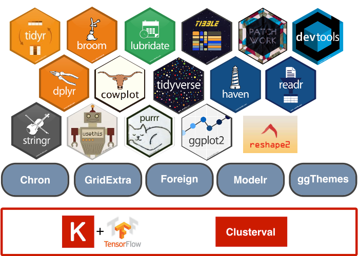
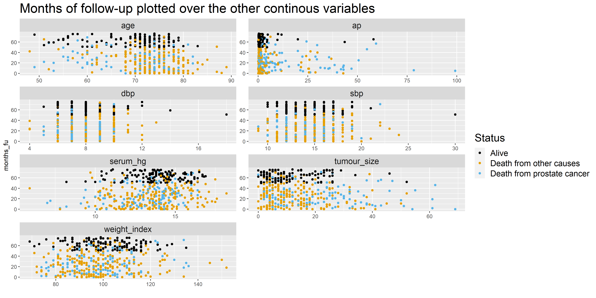
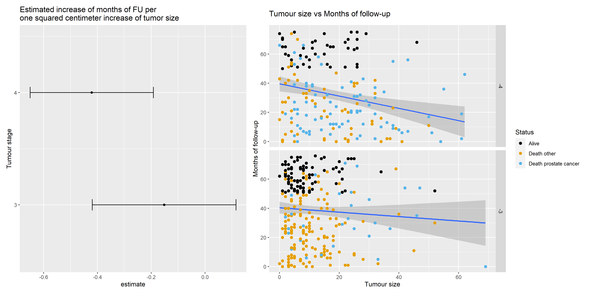

  
```{r include = FALSE}
library(knitr)
library(png)
```
# Introduction

## The Datasets

**Prostate Cancer Dataset**: 1976

- 18 variables

- 502 observations

**The Cancer Genome Atlas (TCGA) Datasets**: 2019

- Divided in two datasets: "TCGA Phenotype" and "TCGA Survival"

- 127 variables

- 623 observations

__7 variables in common__ between the datasets

## Replicability and reproducibility {.flexbox .vcenter}

```{r echo=FALSE, out.width = "100%"}

```

## What to look for

Defining a predictive model of 

- Survival in months of follow-up
- Status of patients
  - Alive
  - Dead for prostate Cancer
  - Dead for other causes

# Matherials and Methods 

## Our packages {.flexbox .vcenter}

```{r echo=FALSE, out.width = "90%"} 

``` 

## Cleaning and Tidying 
- Names 
- Removing rows with NAs
- Discard meaningless variables
- Rearrange the data: estrogen_mg column
```{r echo=FALSE, out.width = "60%"}

```

## Cleaning and Tidying 

- Rearrange the data: date format
```{r,  eval = FALSE}
prostate_clean <- prostate_clean %>%
  mutate(date_on_study = as_date(x = date_on_study, 
                                 origin = "1960-01-01"))
```
```{r echo=FALSE, out.width = "60%"}

```

## Augment 
- Dataset identifier
- One Hot Encoding 
- Categorical column "cat_status" describing the cause of death 
- TCGA data: Making the common variables in the two datasets comparable
- os_time from days to months
- Binarize bone_scan_results
- Obtain sg value from gleason score

<!-- (The information we want to get from the data is the division between the patients that died for prostate cancer, for other causes and the ones that are still alive, we don't care about the distinction between the other causes of death) -->

## Augment | Joining of the datasets {.flexbox .vcenter}

```{r echo=FALSE, out.width = "100%"}

```

## PCA and Clustering
Calculation of the principal components using __prcomp__
```{r,  eval = FALSE}
# Obtain components
prostate_pca <- prostate_for_pca %>%
  na.omit() %>%
  prcomp(center = TRUE, scale = TRUE)
```
Verification that the PC1 and PC2 account for the most variation in the data
```{r,  eval = FALSE}
# Calculate the variance explained by each component
variance_explained <- prostate_pca %>% 
  tidy("pcs")
```
Then we perform a clustering using __kmeans__

## Regression
Regression with the variable which seems the most correlated with the survival
```{r eval = FALSE}
get_mdls <- function(dataset) {
  return(lm(months_fu ~ tumour_size, data = dataset))
}

prostate_data_mdl <- prostate_for_lr %>%
  filter(dataset == 0) %>%
  group_by(stage) %>%
  nest() %>%
  mutate(mdls = map(data, get_mdls)) 
```

## Classification
We used __Keras TensorFlow__ to classify the data basing on the "cat_status" variable
```{r eval = FALSE}
model <- keras_model_sequential() %>%
  layer_dense(
    units = n_hidden_1,
    activation = h1_activate, input_shape = c(24)) %>%
  layer_dense(units = n_output, activation = o_ativate)
```

# Results and discussion

## Data Visualization using ggplot | Histograms and barplots of all the continuous variables {.flexbox .vcenter}
```{r echo=FALSE, out.width = "90%"}
include_graphics("../results/04_histogram_and_boxplot_of_tumour_size.png")
```

## Data Visualization using ggplot | Survival versus each other variable {.flexbox .vcenter}
```{r echo=FALSE, out.width = "95%"}

```

## PCA k means clustering {.flexbox .vcenter}
For this part of the analysis we choose to only consider the 1976 dataset
<!-- There might be three clusters.  -->
```{r echo=FALSE, out.width = "100%"}
include_graphics("../results/05_pca_clustering.png")
```


## Regression {.flexbox .vcenter}

```{r echo=FALSE, out.width = "105%"}

```


## Classification {.flexbox .vcenter}

```{r echo=FALSE, out.width = "100%"}

```


# Conclusions

---

- There seems to be no correlation between the variables 

- The classification, considering the small number of analized values, gives appreciable results
 

# Thank you for watching!
 

 