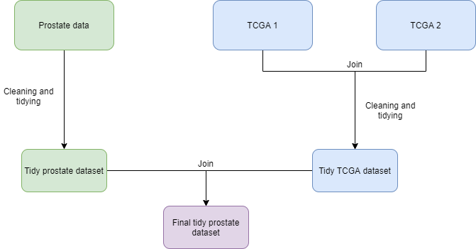
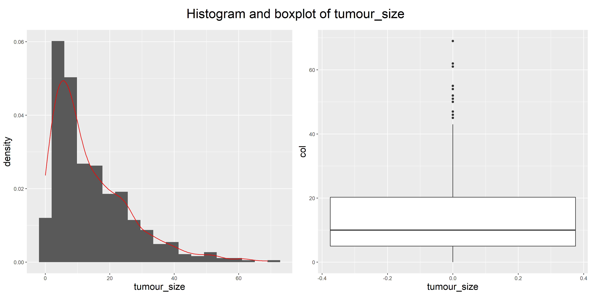
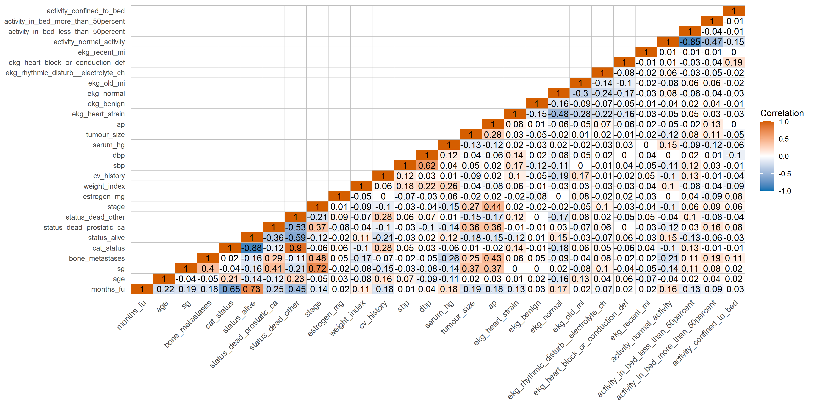
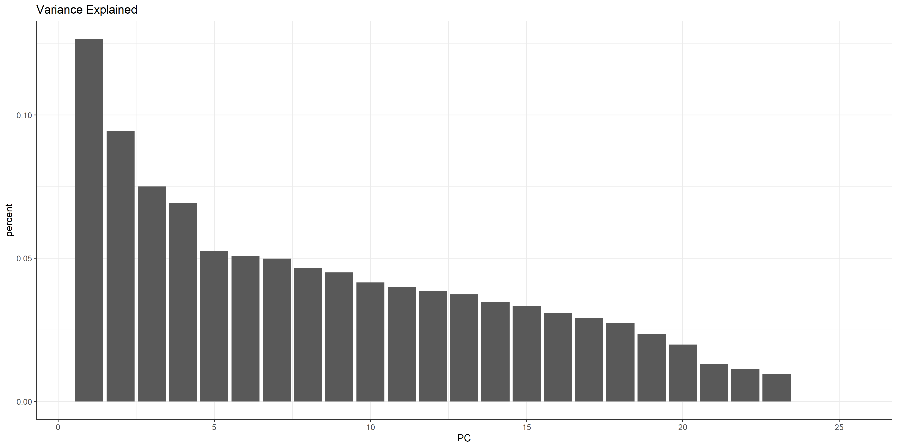
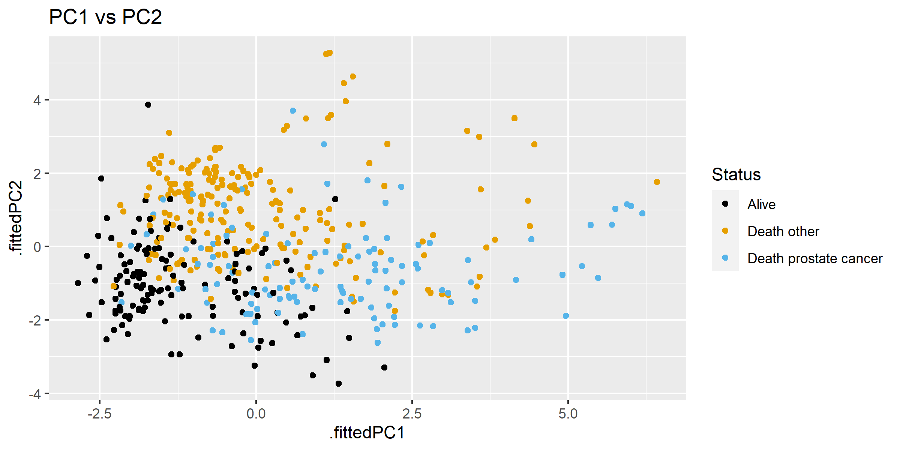

  
```{r include = FALSE}
library(knitr)
library(png)
library(DiagrammeR)
```
## Introduction

## The Project

**Prostate Cancer Data Analysis**

- The Datasets
- Cleaning
- Augmenting
- What to look for

## The Datasets

```{r echo=FALSE, out.width = "100%"}

#png("../docs/tidying_workflow.png")

```

**Prostate Cancer Dataset**: 1976

- 18 variables

- 502 observations

**The Cancer Genome Atlas (TCGA) Datasets**: 2019

- 127 variables

- 623 observations

divided in two datasets:
  
  "TCGA Phenotype" and "TCGA Survival"

## Cleaning the data

Why cleaning? What was wrong with our datasets? 
  
  ## Augment 
  - We needed a way to identify the two dataset once joined --> dataset col
- One Hot Encoding for each categorical variable in each dataset
- Prostate Data: Creating categorical column "cat_status" describing the cause of death: 
  - Dead for prostate cancer
- Dead for other causes
- Alive
- TCGA data: Making the common variables in the two datasets comparable
- os_time from days to months
- Binarize bone_scan_results
- Obtain sg value from gleason score

## What to look for

- CLUSTERING: we use k-means and PCA to cluster based on the patient status: alive, dead of prostate cancer or dead of other causes. 
- REGRESSION: we want to find a function to predict the survival of the patients basing on other variables(choose the variables looking at the scatterplots)
- CLASSIFICATION we want to predict if a patient is going to survive or to die from prostate cancer or die from other causes 


## Matherials and Methods    

## Cleaning and Tidying Prostate Cancer Data
- Changing names (no spaces, reasonable for the content, no cap letters)
- Removing rows with missing values
- Modifying estrogen_mg column removing the str " mg estrogen"
- The column has then been transformed into a double with the command as.numeric because it was a string
- The variable date has been converted to a more readable date format (conversion from R coding of the dates to numbers that represent the distance from a certain initial date)
```{r,  eval=FALSE}
## Prostate_raw cleaning

# Transfom the data variable in a more readable version
prostate_clean <- prostate_clean %>%
  mutate(date_on_study = as_date(x = date_on_study, origin = "1960-01-01"))
```
## Cleaning and Tidying TCGA Dataset
- Changing names (no spaces, reasonable for the content, no capital letters)
- Removing rows with missing values
- Selecting variables of interest

## Augment Prostate Cancer Dataset
- Added column "dataset" to identify the dataset
- One Hot Encoding for each categorical variable 
- Creating categorical column "cat_status" describing the cause of death: 
  - Dead for prostate cancer
- Dead for other causes
- Alive

<!-- (The information we want to get from the data is the division between the patients that died for prostate cancer, for other causes and the ones that are still alive, we don't care about the distinction between the other causes of death) -->

## Augment TCGA Dataset
- Added column "dataset" to identify the dataset
- One Hot Encoding for each categorical variable 
- Making the common variables in the two datasets comparable
    - os_time from days to months
    - Binarize bone_scan_results
    - Obtain sg value from gleason score

## Augment
Joining of the TCGA datasets:
- anti_join to check that we are not missing any information 
- inner_join between the two TCGA datasets 
- full_join to merge the TCGA Dataset and the Prostate Cancer Dataset


## PCA 
We choose to only consider the 1976 dataset ... 

We calculated the principal components using prcomp and we used broom::tidy to verify that the PC1 and PC2 account for the most variation in the data (???? I don't know if this is useful and what are we suppose to write in the methods if not the code)

## k clustering 

...

## Regression

... 

## Classification

....


## Results

## Data Visualization using ggplot

We choose to only consider the 1976 dataset ... 

- Histograms and barplots of all the continuous variables

```{r echo=FALSE, out.width = "80%"}


```
## Data Visualization using ggplot

- Survival versus each other variable 

```{r echo=FALSE, out.width = "95%"}
include_graphics("../results/04_months_fu_vs_others.png")
```
## Data Visualization using ggplot

- Correlation matrix

```{r echo=FALSE, out.width = "95%"}

```


## PCA

For this part of the analysis we choose to only consider the 1976 dataset

```{r echo=FALSE, out.width = "95%"}

```
<!-- we can see that PC1 and PC2 capture the most variation in the data, although the cumulative variation explained by the two is only the 22%.  -->
  
  ## PCA
  
  Plotting of PC1 and PC2. The colors reflect the status of the patients.  
```{r echo=FALSE, out.width = "100%"}

```
<!-- There might be three clusters.  -->
  
  ## k means clustering
  
```{r echo=FALSE, out.width = "100%"}

```


## Regression
-
  ## Classification
  
  ## Discussion ?? 