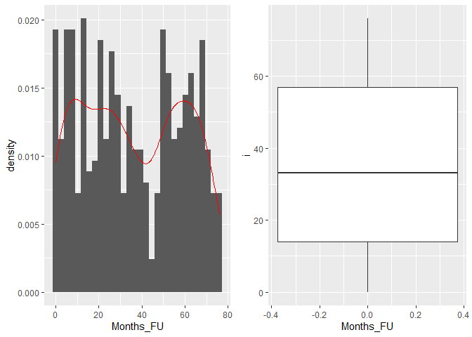
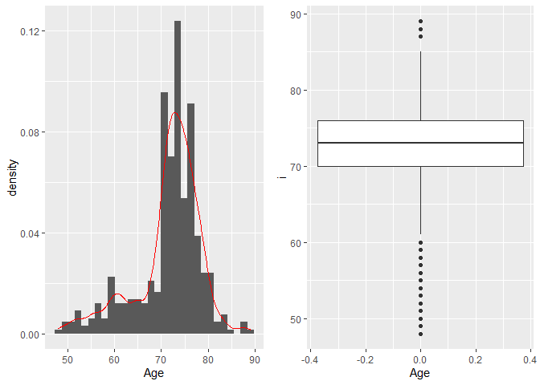
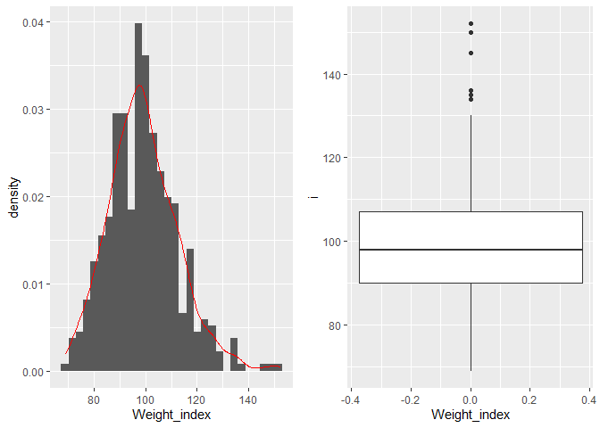
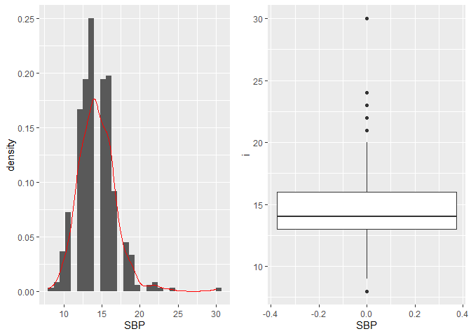
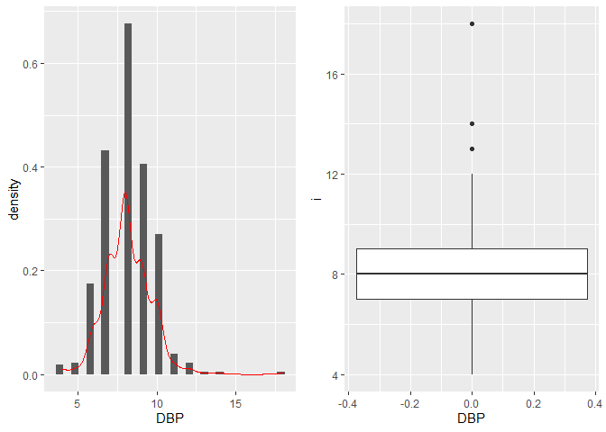
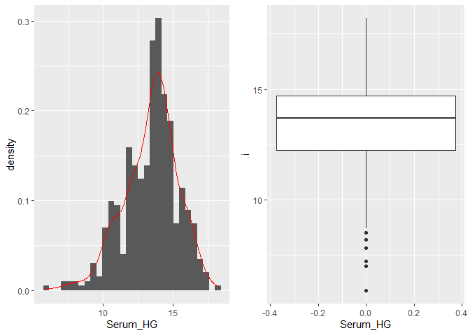
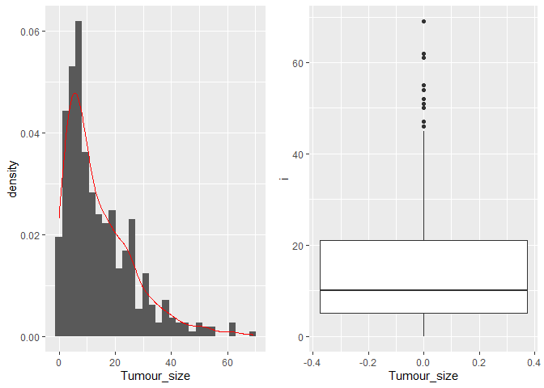
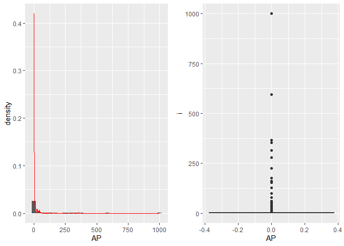
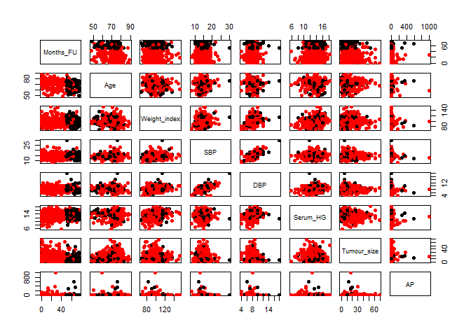

Untitled
================

First step: reading the data into R

``` r
library(foreign) #necessary to import the dta data
library(tidyverse)
```

    ## -- Attaching packages ---------------------------------------------------------------------------------- tidyverse 1.3.0 --

    ## v ggplot2 3.3.0     v purrr   0.3.3
    ## v tibble  2.1.3     v dplyr   0.8.5
    ## v tidyr   1.0.2     v stringr 1.4.0
    ## v readr   1.3.1     v forcats 0.5.0

    ## -- Conflicts ------------------------------------------------------------------------------------- tidyverse_conflicts() --
    ## x dplyr::filter() masks stats::filter()
    ## x dplyr::lag()    masks stats::lag()

``` r
library(chron)
```

    ## NOTE: The default cutoff when expanding a 2-digit year
    ## to a 4-digit year will change from 30 to 69 by Aug 2020
    ## (as for Date and POSIXct in base R.)

``` r
library(date)
library(ggplot2)
require(gridExtra)
```

    ## Loading required package: gridExtra

    ## 
    ## Attaching package: 'gridExtra'

    ## The following object is masked from 'package:dplyr':
    ## 
    ##     combine

``` r
prostate_raw <- read.dta("Data/_raw/prostate.dta")

colnames(prostate_raw)
```

    ##  [1] "patno"  "stage"  "rx"     "dtime"  "status" "age"    "wt"     "pf"    
    ##  [9] "hx"     "sbp"    "dbp"    "ekg"    "hg"     "sz"     "sg"     "ap"    
    ## [17] "bm"     "sdate"

We decided to change the name of the columns in order to have a better
description of the data.

``` r
col_names <- c("Patient_ID", "Stage", "Estrogen(mg)", "Months_FU", "Status", "Age", "Weight_index", "Activity_level", "CV_history", "SBP", "DBP", "EKG", "Serum_HG", "Tumour_size", "SG", "AP", "Bone_metastases", "Date_on_study")

colnames(prostate_raw) <- col_names
```

``` r
prostate_raw <- as_tibble(prostate_raw) #conversion of the data into a tibble

prostate_data <- prostate_raw %>% 
                  na.exclude(.)         #removing the rows which contain at least one NA

prostate_data <- prostate_data %>% 
  mutate(`Estrogen(mg)` = str_replace_all(string = `Estrogen(mg)`, pattern = "placebo", replacement = "0.0")) %>% 
  separate(data = ., col = `Estrogen(mg)`, into = c("Estrogen(mg)", "Estr"), sep = "mg") %>% 
  dplyr::select(-Estr)
```

    ## Warning: Expected 2 pieces. Missing pieces filled with `NA` in 119 rows [4, 6,
    ## 7, 13, 16, 22, 26, 27, 33, 36, 40, 42, 47, 48, 52, 56, 58, 60, 65, 69, ...].

``` r
prostate_data <- prostate_data %>% 
  mutate(`Estrogen(mg)`= as.numeric(x = `Estrogen(mg)`, digits = 2))

#split the estrogen (mg) col into two cols + deletion of the Estr col, since it contains only the word "estrogen"
```

Now we modify the Status column assigning a number to each possible
status (0 - alive, 1 - dead for X cause….)

``` r
prostate_data <- prostate_data %>% 
  mutate("Status" = as.integer(prostate_data$Status) -1)

#we also checked that the correspondence between numbers and causes of deaths is correct
```

Transfom the data variable in a readable version

``` r
prostate_data <- prostate_data %>% 
  mutate("Date_on_study" = as.Date(x = `Date_on_study`, origin = "1960-01-01") )
```

Data visualization using ggplot2

``` r
View(prostate_data)
data_to_plot <- prostate_data %>% 
  dplyr::select(c(Months_FU, Age, Weight_index, SBP, DBP, Serum_HG, Tumour_size, AP))

plot_list <- vector("list", length = length(colnames(data_to_plot)))
for (i in 1:length(plot_list)) {
  plot_list[[i]] <- list("boxplot" = NULL, "barplot" = NULL)
  
}

j <- 1

for (i in data_to_plot) {
  
 barplot_i <- ggplot(data = data_to_plot, 
         mapping = aes(x = i)) +
    geom_histogram(aes(y=..density..)) +
   geom_density(color = "red") +
   labs(x = colnames(data_to_plot)[j])
 
#plot_list[[j]]$barplot <- barplot_i
 
 boxplot_i <- ggplot(data = data_to_plot, 
         mapping = aes(y = i)) +
          geom_boxplot() +
   labs(x = colnames(data_to_plot)[j])
    

#plot_list[[j]]$boxplot <- boxplot_i
  
grid.arrange(barplot_i, boxplot_i, ncol=2) 
 
 j <- j + 1
  
#print(boxplot_i)
#print(barplot_i)
 
}
```

    ## `stat_bin()` using `bins = 30`. Pick better value with `binwidth`.

<!-- -->

    ## `stat_bin()` using `bins = 30`. Pick better value with `binwidth`.

<!-- -->

    ## `stat_bin()` using `bins = 30`. Pick better value with `binwidth`.

<!-- -->

    ## `stat_bin()` using `bins = 30`. Pick better value with `binwidth`.

<!-- -->

    ## `stat_bin()` using `bins = 30`. Pick better value with `binwidth`.

<!-- -->

    ## `stat_bin()` using `bins = 30`. Pick better value with `binwidth`.

<!-- -->

    ## `stat_bin()` using `bins = 30`. Pick better value with `binwidth`.

<!-- -->

    ## `stat_bin()` using `bins = 30`. Pick better value with `binwidth`.

<!-- -->

``` r
plot(data_to_plot, pch = 16, col = ifelse(prostate_data$Status == 0, "black", "red"))
```

<!-- -->

``` r
getwd()
```

    ## [1] "C:/Users/giove/Documents/Universita/Magistrale/R for bio data science/2020_group09"

outlier 999 medical info about AP github
