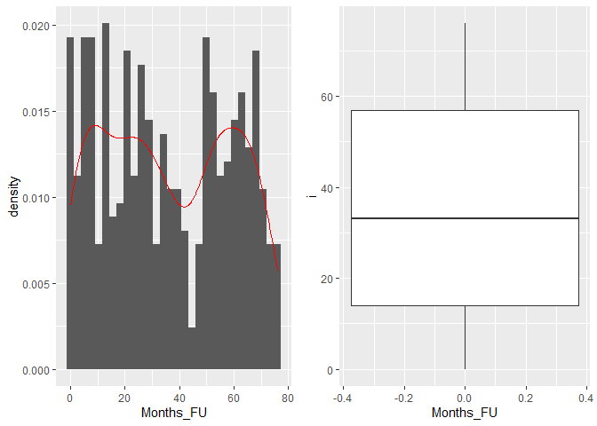
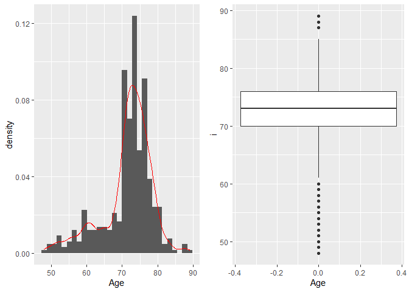
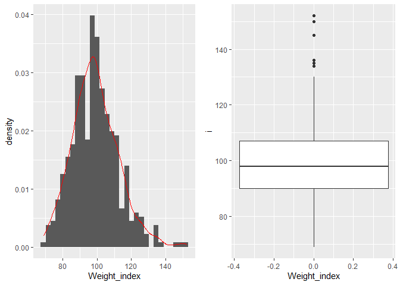
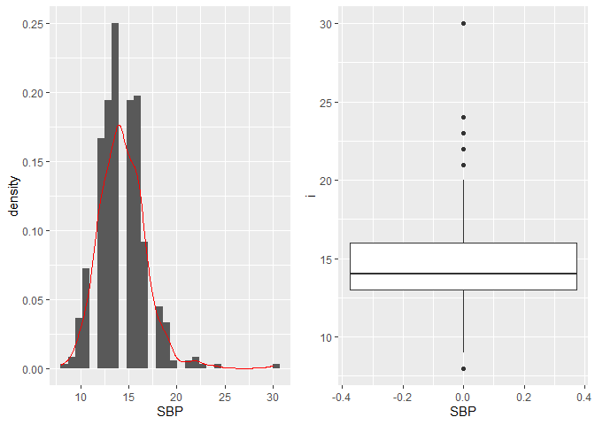
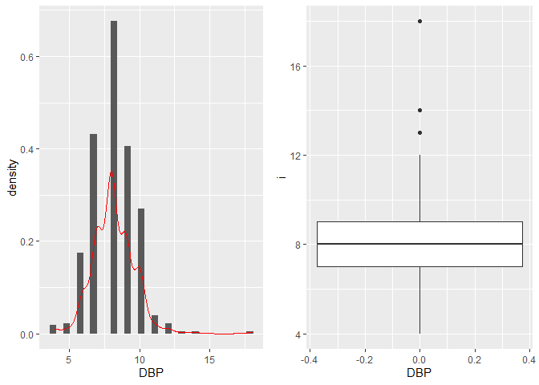
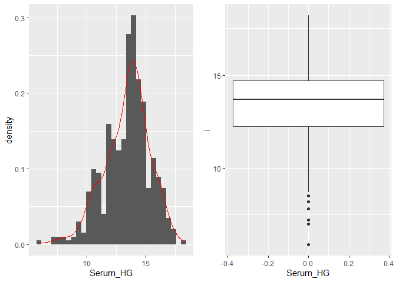
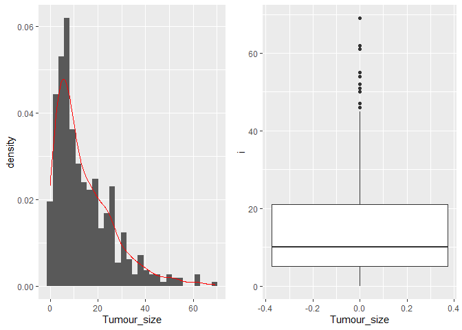
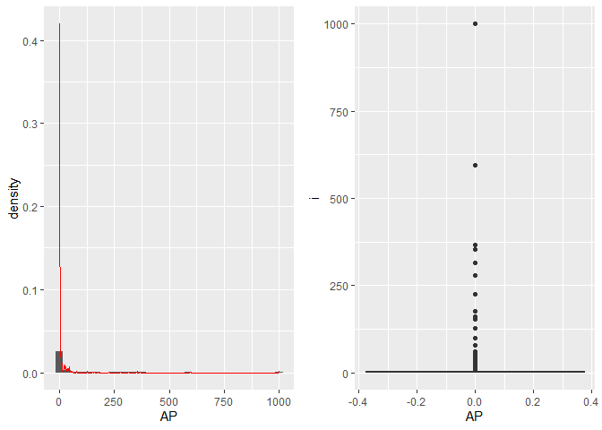
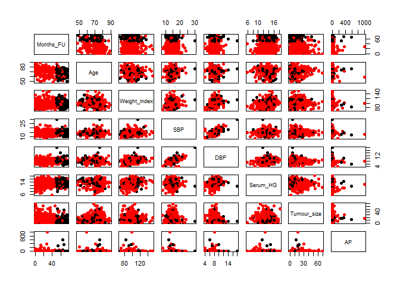

Untitled
================

First step: reading the data into R

``` r
library(foreign) #necessary to import the dta data
library(tidyverse)
```

    ## -- Attaching packages ----------------------------------------------------------------------------------------------------- tidyverse 1.3.0 --

    ## v ggplot2 3.3.0     v purrr   0.3.3
    ## v tibble  2.1.3     v dplyr   0.8.5
    ## v tidyr   1.0.2     v stringr 1.4.0
    ## v readr   1.3.1     v forcats 0.5.0

    ## -- Conflicts -------------------------------------------------------------------------------------------------------- tidyverse_conflicts() --
    ## x dplyr::filter() masks stats::filter()
    ## x dplyr::lag()    masks stats::lag()

``` r
library(chron)
```

    ## NOTE: The default cutoff when expanding a 2-digit year
    ## to a 4-digit year will change from 30 to 69 by Aug 2020
    ## (as for Date and POSIXct in base R.)

``` r
library(date)
library(ggplot2)
require(gridExtra)
```

    ## Loading required package: gridExtra

    ## 
    ## Attaching package: 'gridExtra'

    ## The following object is masked from 'package:dplyr':
    ## 
    ##     combine

Importing the datasets: prostate\_raw is the dataset from the paper
“Selectiong optimal treatment in clinical trails using covariate
information; Byar, D.P.; Corle, D.K. (1976)”,
<http://biostat.mc.vanderbilt.edu/wiki/pub/Main/DataSets/prostate.html>

TCGA\_prostate\_raw and TCGA\_prostate\_survival are two datasets from
<https://xenabrowser.net/datapages/?cohort=GDC%20TCGA%20Prostate%20Cancer%20(PRAD)&removeHub=https%3A%2F%2Fxena.treehouse.gi.ucsc.edu%3A443>,
paper “Unbiased data mining identifies cell cycle transcripts that
predict non-indolent Gleason score 7 prostate cancer, Wendy L. Johnston,
Charles N. Catton and Carol J. Swallow” that we used to complete the
first dataset in order to have more data for the analyses.

``` r
prostate_raw <- read.dta("data/_raw/prostate.dta") #read.dta is a function to import files in the .dta format

TCGA_prostate_raw <- read.table("../2020_group09/data/_raw/TCGA-PRAD.GDC_phenotype.tsv", sep = "\t", header = T, quote = "", na.strings=c("","NA"))
TCGA_prostate_survival_raw <- read.table("../2020_group09/data/_raw/TCGA-PRAD.survival.tsv", sep = "\t", header = T, quote = "", na.strings=c("","NA"))
#in both cases we used na.strings to fill the empty cells with NAs, quote = "" disables the quoting (without disabling quotes the file is not fully loaded in R). 
```

We decided to change the name of the columns of prostate\_raw in order
to have a better description of the data.

``` r
col_names <- c("Patient_ID", "Stage", "Estrogen(mg)", "Months_FU", "Status", "Age", "Weight_index", "Activity_level", "CV_history", "SBP", "DBP", "EKG", "Serum_HG", "Tumour_size", "SG", "AP", "Bone_metastases", "Date_on_study")

colnames(prostate_raw) <- col_names
```

``` r
prostate_raw <- as_tibble(prostate_raw) #conversion of the data into a tibble

prostate_data <- prostate_raw %>% 
                  na.exclude(.)         #removing the rows which contain at least one NA

prostate_data <- prostate_data %>% 
  mutate(`Estrogen(mg)` = str_replace_all(string = `Estrogen(mg)`, pattern = "placebo", replacement = "0.0")) %>% 
  separate(data = ., col = `Estrogen(mg)`, into = c("Estrogen(mg)", "Estr"), sep = "mg") %>% 
  dplyr::select(-Estr)
```

    ## Warning: Expected 2 pieces. Missing pieces filled with `NA` in 119 rows [4, 6,
    ## 7, 13, 16, 22, 26, 27, 33, 36, 40, 42, 47, 48, 52, 56, 58, 60, 65, 69, ...].

``` r
#we want to have the Estrogen column filled with numbers that correspond to the mg of estrogen used to treat the patient. 
#So, we used str.replace to replace the word "placebo" with 0.0 and then we remove the "mg estrogen" string in each cell by splitting the estrogen (mg) col into two cols using "mg" as separator. 

prostate_data <- prostate_data %>% 
  mutate(`Estrogen(mg)`= as.numeric(x = `Estrogen(mg)`, digits = 2))

#deletion of the Estr col, since it contains only the word "estrogen"
```

Now we modify the Status column assigning a number to each possible
status 0 - alive 1 - dead from prostatic cancer 2 - dead from heart or
CV disease 3 - dead from cerebrovascular accident 4 - dead from
pulmonary embolus 5 - dead from other cancer 6 - dead from respiratory
disease 7 - dead from other specific non-cancer case 8 - dead from
unspecific non-cancer cause 9 - dead from unknown cause

``` r
prostate_data <- prostate_data %>% 
  mutate("Status" = as.integer(prostate_data$Status) -1)

#we also checked that the correspondence between numbers and causes of deaths is correct, before deleting the original column
```

Transfom the data variable in a more readable version

``` r
prostate_data <- prostate_data %>% 
  mutate("Date_on_study" = as.Date(x = `Date_on_study`, origin = "1960-01-01") )
```

Working in the TCGA datasets

``` r
colnames(TCGA_prostate_raw)[1] <- "Sample_ID"
colnames(TCGA_prostate_survival_raw)[1] <- colnames(TCGA_prostate_raw)[1] #we modified the name of the first column of both TCGA datasets into "Sample_ID" in order to be able to use left_join using Sample_ID as the key column. 

!any(TCGA_prostate_raw$Sample_ID %in% TCGA_prostate_survival_raw$Sample_ID) # before unifing the two columns we check if the two Sample_ID columns contain the same IDs (just to be sure that we are not loosing data without knowning it). 
```

    ## [1] FALSE

``` r
#based on the logical test performed above, they are, so we decide to use dplyr::left_join to unify the two tables by the "Sample_ID" column. 

TCGA_prostate_tot <- left_join(x = TCGA_prostate_raw, y = TCGA_prostate_survival_raw, by = "Sample_ID")
```

Now we examine the TCGA new dataset to find columns containing the same
type of information contained in “prostate\_data”, in order to join the
two datasets and perform the analyses.

prostate data TCGA Patient id patient\_id Age
age\_at\_initial\_pathologic\_diagnosis bone\_metastasis
bone\_scan\_results –\> retain only normal + abnormal == 0, prostate
cancer == 1, while equivocal == NA. monts of FU OS.time –\> those are
days, we have to transform them in months AP correlates with gleason
score –\> find a way to transform one into the other

``` r
TCGA_prostate_def <- TCGA_prostate_tot %>% 
                      select("Patient_ID" = patient_id, age_at_initial_pathologic_diagnosis, bone_scan_results, OS.time, gleason_score) #we select the columns we are interested in and we rename the patient_id column in the TCGA dataset. In this way, both datasets has the same name for the column containing the patient ids. 

TCGA_prostate_def <- TCGA_prostate_def %>%
                      unique()
#with unique() we remove duplicated in the datasets. So, we remove rows with the exact same content. 

prostate_data$Patient_ID <- as.factor(prostate_data$Patient_ID) #conversion of the Patient_ID col in prostate_data into a factor column, in order to be able to use full_join (you cannot use full_join if the key columns belong to different classes). 

TCGA_prostate_def <- TCGA_prostate_def %>% 
  mutate("Months_FU" = round(OS.time/30, digits = 0), OS.time = NULL) #here we convert the content of the OS.time column from days to months. 

TCGA_prostate_def <- TCGA_prostate_def %>% 
  mutate("Bone_metastases" = (case_when(
                          bone_scan_results == "Normal (no evidence of prostate cancer) [cM0]" ~ 0, 
                          bone_scan_results == "Abnormal (not related to prostate cancer)" ~ 0, 
                          bone_scan_results == "Prostate Cancer Metastases Present [cM1b]" ~ 1)), bone_scan_results = NULL)


colnames(TCGA_prostate_def) <- c("Patient_ID", "Age", "Months_FU", "AP..")
```

Data visualization using ggplot2

``` r
View(prostate_data)
data_to_plot <- prostate_data %>% 
  dplyr::select(c(Months_FU, Age, Weight_index, SBP, DBP, Serum_HG, Tumour_size, AP))

plot_list <- vector("list", length = length(colnames(data_to_plot)))
for (i in 1:length(plot_list)) {
  plot_list[[i]] <- list("boxplot" = NULL, "barplot" = NULL)
  
}

j <- 1

for (i in data_to_plot) {
  
 barplot_i <- ggplot(data = data_to_plot, 
         mapping = aes(x = i)) +
    geom_histogram(aes(y=..density..)) +
   geom_density(color = "red") +
   labs(x = colnames(data_to_plot)[j])
 
#plot_list[[j]]$barplot <- barplot_i
 
 boxplot_i <- ggplot(data = data_to_plot, 
         mapping = aes(y = i)) +
          geom_boxplot() +
   labs(x = colnames(data_to_plot)[j])
    

#plot_list[[j]]$boxplot <- boxplot_i
  
grid.arrange(barplot_i, boxplot_i, ncol=2) 
 
 j <- j + 1
  
#print(boxplot_i)
#print(barplot_i)
 
}
```

    ## `stat_bin()` using `bins = 30`. Pick better value with `binwidth`.

<!-- -->

    ## `stat_bin()` using `bins = 30`. Pick better value with `binwidth`.

<!-- -->

    ## `stat_bin()` using `bins = 30`. Pick better value with `binwidth`.

<!-- -->

    ## `stat_bin()` using `bins = 30`. Pick better value with `binwidth`.

<!-- -->

    ## `stat_bin()` using `bins = 30`. Pick better value with `binwidth`.

<!-- -->

    ## `stat_bin()` using `bins = 30`. Pick better value with `binwidth`.

<!-- -->

    ## `stat_bin()` using `bins = 30`. Pick better value with `binwidth`.

<!-- -->

    ## `stat_bin()` using `bins = 30`. Pick better value with `binwidth`.

<!-- -->

``` r
plot(data_to_plot, pch = 16, col = ifelse(prostate_data$Status == 0, "black", "red"))
```

<!-- -->

``` r
getwd()
```

    ## [1] "C:/Users/giove/Documents/Universita/Magistrale/R for bio data science/2020_group09"
